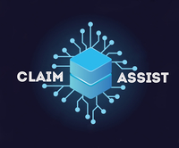

<<<<<<< HEAD
ee

# Claim Assist
> All your claims under one roof
=======
		

# Claim Assit
>> All your claims under one roof
>>>>>>> 413c5e97309e9083df507859d036aa3ca160abba
----------------------------
Claim assist is a secure, decentralized application to handle all the claims settlement.

In the current scenario when an accident occurs, the two parties involved have to go through the entire rigorous and time-consuming process of claim settlement, starting from form filling to claim generation. To facilitate the policyholders, we have developed a web application that is automated, secure and easy to use. 
Further, we have used blockchain technology for handling the claim data which makes it fully tamperproof and reliable.


## Included Components
----------------------------
- Ethereum
- BigchainDB
- IPFS

## Prerequisites
----------------------------
- Node : https://nodejs.org/en/
- NPM : https://www.npmjs.com/
- Truffle : https://truffleframework.com/
- BigchainDB : https://www.bigchaindb.com/
- IPFS : https://ipfs.io/

## Usecases
----------------------------

We have covered three different use cases :

1. Use case 1: Both the parties involved in the accident come to a mutual agreement on who is liable and submit the accident statement form to their respective insurance companies.
2. Use case 2: There is no mutual agreement on the accident perpetrator and hence they call Police to the scene and get the verification done. The Police will have to upload the report against the respective claim, based on the evidence collected.
3. Use case 3: There is an injury involved and hence there will be both Police and Hospital involved in the claim process. Both will generate their bills/reports and upload against the respective claim.

## Architecture
----------------------------


## Compatibility with other Blockchain based insurance applications
----------------------------
We have designed our distributed application such that it can act as a third-party service to multiple insurance companies. Our aim is to ease the claim generation and settlement process for insurance companies and involved stakeholders. We provide an API for the insurance companies where they can request for all the data that is required for their claim handling process. Claim data is encrypted and tamper-proof. 


## Application Workflow
----------------------------

### Claim Generation
----------------------------
The Accident victim/perpetrator logs into the system and fills the Claim form. On submitting the form, the form details and the supporting files are also stored on IPFS. The hash of these files is stored over the BigchainDB along with the Claim id. BigchainDB acts as a registry for all the claim related data. The hash of BigchainDB is now stored in the blockchain against the Claim id. This completes the Claim generation process.


### Verification and Update
----------------------------
Now the other party can log into our system and see the respective claim on Notifications page. When he clicks on View, the claim data is retrieved back from the blockchain and displayed to the user. Now the victim can verify the data filled by the first party, agree/disagree with the details, and also give his remarks and submit the form. The Claim updating process works similar to the Claim generation. The updated file is stored in IPFS and the new IPFS hash is stored in BigchainDB, and finally, the new BigchainDB hash is stored in the blockchain.


### Police Report 
----------------------------
Meanwhile, the police will get a notification about the accident. They will investigate the case, generate a report and upload all the supporting documents. 


### Hospital Report
----------------------------
If any injuries are involved in the accident the Hospital also will come into the picture. The hospital can also login into our system and upload all the bills and other documents and submit it with the Claim id.


## Steps:
----------------------------
# 1.Run the application
- Clone the repository:
`git clone git@bitbucket.org:dheerajsuvarna2/blockinsurance.git`
- Go to the project directory and install the dependencies:
```npm install```
- Run the application finally :
` npm run `

Use the link http://localhost:3001 to load the web application in the browser.

This will take you to the landing page of our application. You can find more details about our application here.
<<<<<<< HEAD


## Contributing

When you publish something open source, one of the greatest motivations is that
anyone can just jump in and start contributing to your project.

These paragraphs are meant to welcome those kind souls to feel that they are
needed. You should state something like:

"If you'd like to contribute, please fork the repository and use a feature
branch. Pull requests are warmly welcome."

If there's anything else the developer needs to know (e.g. the code style
guide), you should link it here. If there's a lot of things to take into
consideration, it is common to separate this section to its own file called
`CONTRIBUTING.md` (or similar). If so, you should say that it exists here.

## Links

Even though this information can be found inside the project on machine-readable
format like in a .json file, it's good to include a summary of most useful
links to humans using your project. You can include links like:

- Project homepage: https://your.github.com/awesome-project/
- Repository: https://github.com/your/awesome-project/
- Issue tracker: https://github.com/your/awesome-project/issues
  - In case of sensitive bugs like security vulnerabilities, please contact
    my@email.com directly instead of using the issue tracker. We value your effort
    to improve the security and privacy of this project!
- Related projects:
  - Your other project: https://github.com/your/other-project/
  - Someone else's project: https://github.com/someones/awesome-project/


## Licensing

One really important part: Give your project a proper license. Here you should
state what the license is and how to find the text version of the license.
Something like:

"The code in this project is licensed under MIT license."
=======
>>>>>>> 413c5e97309e9083df507859d036aa3ca160abba
