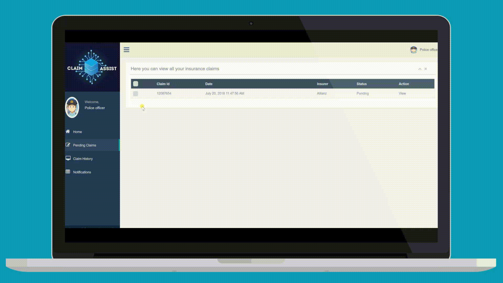
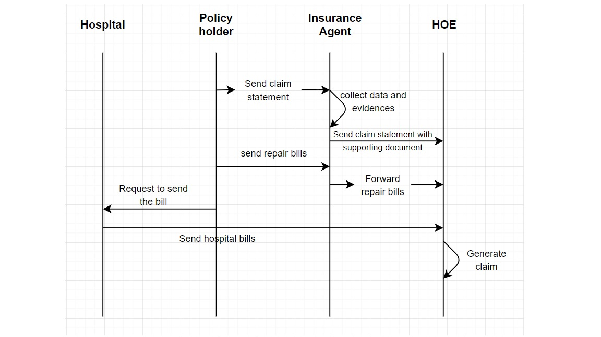

# Claim Assist
> All your claims under one roof

----------------------------
Claim assist is a secure, decentralized application to handle all the claims settlement.

In the current scenario when an accident occurs, the two parties involved have to go through the entire rigorous and time-consuming process of claim settlement, starting from form filling to claim generation. To facilitate the policyholders, we have developed a web application that is automated, secure and easy to use. Further, we have used blockchain technology for handling the claim data which makes it fully tamperproof and reliable.

## Included Components
----------------------------
- Ethereum
- BigchainDB
- IPFS

## Prerequisites
----------------------------
- Node : https://nodejs.org/en/
- NPM : https://www.npmjs.com/
- Truffle : https://truffleframework.com/
- BigchainDB : https://www.bigchaindb.com/
- IPFS : https://ipfs.io/

## Usecases
----------------------------

We have covered three different use cases :

1. Use case 1: Both the parties involved in the accident come to a mutual agreement on who is liable and submit the accident statement form to their respective insurance companies.
2. Use case 2: There is no mutual agreement on the accident perpetrator and hence they call Police to the scene and get the verification done. The Police will have to upload the report against the respective claim, based on the evidence collected.
3. Use case 3: There is an injury involved and hence there will be both Police and Hospital involved in the claim process. Both will generate their bills/reports and upload against the respective claim.

## Architecture
----------------------------
We have used Hub and Spoke architecture where `ClaimStorage.sol` is our hub and other contracts as our spokes. We also employed a persistent storage model which helps in upgradability of contracts. The DApp code interacts with the spokes and store/update/retrieve the data from the storage contract.  

## Compatibility with other Blockchain based insurance applications
----------------------------
We have designed our distributed application such that it can act as a third-party service to multiple insurance companies. Our aim is to ease the claim generation and settlement process for insurance companies and involved stakeholders. We provide an API for the insurance companies where they can request for all the data that is required for their claim handling process. Claim data is encrypted and tamper-proof.

## Application Workflow
----------------------------

### Claim Generation
----------------------------
The Accident victim/perpetrator logs into the system and fills the Claim form. On submitting the form, the form details and the supporting files are also stored on IPFS. The hash of these files is stored over the BigchainDB along with the Claim id. BigchainDB acts as a registry for all the claim related data. The hash of BigchainDB is now stored in the blockchain against the Claim id. This completes the Claim generation process.

### Verification and Update
----------------------------
Now the other party can log into our system and see the respective claim on Notifications page. When he clicks on View, the claim data is retrieved back from the blockchain and displayed to the user. Now the victim can verify the data filled by the first party, agree/disagree with the details, and also give his remarks and submit the form. The Claim updating process works similar to the Claim generation. The updated file is stored in IPFS and the new IPFS hash is stored in BigchainDB, and finally, the new BigchainDB hash is stored in the blockchain.

### Police Report
----------------------------
Meanwhile, the police will get a notification about the accident. They will investigate the case, generate a report and upload all the supporting documents.

### Hospital Report
----------------------------
If any injuries are involved in the accident the Hospital also will come into the picture. The hospital can also login into our system and upload all the bills and other documents and submit it with the Claim id.

## Steps:
----------------------------
# 1.Run the application
- Clone the repository: `git clone git@bitbucket.org:dheerajsuvarna2/blockinsurance.git`
- Install truffle - `npm install -g truffle`
- Install rimraf - `npm install -g rimraf`
- Navigate to the project folder and run - `npm install` - this installs all the dependency modules
- Open another console in the same folder and run - `truffle develop` - this starts the truffle testrpc, which is an Ethereum blockchain test network
- In truffle console, run - `compile` - this compiles the smart contract
- In truffle console, run - `migrate` - this migrates the smart contracts to the test network
- Open another console and run - `npm run build:contracts` - this script copies the contracts from **./.build** folder to **/src/public/contracts**  
- In the first console, run - `npm run start`
- Use the link http://localhost:3001 to load the web application in the browser. This will take you to the landing page of our application. You can find more details about our application here.

# Project structure
- ./contracts/claimAssist - Smart contracts are in this folder.
- ./migrations - Contains the migration script. It migrates the contract to the blockchain.
- ./src/public/blockinsurance - Contains the Dapp code for Claim Assist application.
- ./src/public/blockinsurance/js/controllers/index.js - Contains the frontend JavaScript code.
- ./src/server/claimAssist.js - Contains the routes.
- ./src/server/index.js - Contains the server code.
- ./src/server - Contains the code for encryption and interacting with BigchainDB and IPFS.
